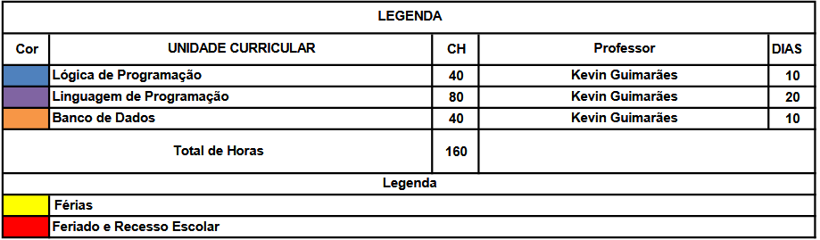

# Curso de Programador de Sistemas

Bem-vindo ao repositório do Curso de Programador de Sistemas oferecido pelo SENAI! Este repositório contém todos os materiais necessários para as aulas das disciplinas de Lógica de Programação, Linguagem de Programação, Banco de Dados e Engenharia de Software.

## Disciplinas

- **Lógica de Programação**
- **Linguagem de Programação**
- **Banco de Dados**

## Atividades do Beecrowd
<!--
```
Realizar as atividades 

-------------INICIANTE---------------
#1000 | #1001 | #1002 | #1003 | #1004 
#1005 | #1006 | #1007 | #1008 | #1009
#1010 | #1011 | #1012 | #1013 | #1014 
#1015 | #1016 | #1017 | #1018 | #1019
#1020 | #1021 | #1035 | #1036 | #1037 
#1038 | #1040 | #1041 | #1042 | #1043
#1044 | #1045 | #1046 | #1048 | #1049 
#1050 | #1051 | #1052 | #1059 | #1060
#1181 | #1182 | #1183 | #1184 | #1094
#1098 | #1101 | #1118 | #1133


```
-->
## Datas das Provas
<!--
```
Prova 01: Lógica de Programação - 17/02/2025
Recuperação Prova 01 - 24/02/2025

Prova 02: Linguagem de Programação - 25/02/2025
Recuperação Prova 02 - 10/03/2025


```
-->
## Estrutura dos Diretórios

Cada disciplina possui um diretório próprio onde estarão disponíveis todos os materiais necessários, incluindo aulas, códigos de exemplo, exercícios e provas que serão realizados no decorrer do curso.

```
/Curso-Programador-de-Sistemas
│
├── Logica-de-Programacao
│ ├── aulas
│ ├── exemplos
│ ├── exercicios
│ └── provas
│
├── Linguagem-de-Programacao
│ ├── aulas
│ ├── exemplos
│ ├── exercicios
│ └── provas
│
├── Banco-de-Dados
 ├── aulas
 ├── exemplos
 ├── exercicios
 └── provas
```

## Calendário

Confira o calendário das disciplinas no arquivo anexo [Calendário Programador de Sistemas](https://github.com/KevinSGuimaraes/ProgramadorDeSistemas-V/blob/main/Imagens/PROGRAMADOR_SISTEMAS_VESPERTINO_2025.pdf).

# Critérios e Procedimentos de Faltas


	
# Lista de Presença

# Lista de Notas


## Como Usar este Repositório

1. Clone este repositório para o seu ambiente local:
    ```
    git clone https://github.com/KevinSGuimaraes/ProgramadorDeSistemas-V.git
    ```
2. Navegue até a pasta da disciplina desejada.
3. Siga as instruções e utilize os materiais disponíveis para cada aula.

## Contato

Para dúvidas ou mais informações, entre em contato com o instrutor:
- **Nome do Instrutor**: Kevin Guimarães
- **Email**: kevin.guimaraes3561@sesisenaipr.org.br
